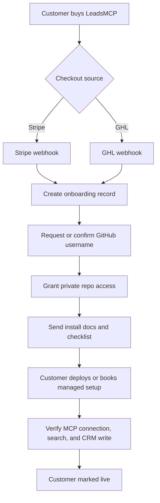

# Checkout and Access Flow

This document turns LeadsMCP into a repeatable commercial onboarding motion.

## Recommended Commercial Paths

### Path A: Stripe-first checkout
Use when selling directly from your own site.

Flow:
1. customer buys LeadsMCP through Stripe
2. payment success webhook creates a customer onboarding record
3. operations receives an alert with:
   - customer name
   - email
   - company
   - chosen plan
   - GitHub username request status
4. customer receives a welcome email with:
   - GitHub username request
   - deployment questionnaire
   - scheduling link if managed onboarding is included
5. once GitHub username is received, customer is granted private repo access
6. customer is assigned a release and onboarding checklist

### Path B: GHL-first checkout
Use when selling through your GHL funnel, forms, or marketplace-style flow.

Flow:
1. customer opts in or purchases through GHL
2. GHL workflow posts a webhook to your onboarding endpoint
3. onboarding record is created
4. customer receives the same welcome and GitHub access sequence
5. if setup includes GHL app install help, customer is guided through redirect URL and location setup

## Minimum Onboarding Record

Capture:
- customer name
- billing email
- company name
- GitHub username
- chosen plan
- support tier
- managed setup yes or no
- deployment path
- Outscraper account status
- GHL status
- Stripe status if export billing is enabled

## Access States

- `lead_captured`
- `paid`
- `awaiting_github_username`
- `repo_invited`
- `deploy_in_progress`
- `first_test_pending`
- `live`

## Operational Checklist

1. verify payment
2. create onboarding record
3. request GitHub username if missing
4. grant private repo access
5. send install docs
6. confirm customer credentials are customer-owned
7. verify first deployment
8. verify one live search and one CRM write

## Suggested Automation Triggers

### Stripe webhook
Trigger on:
- checkout completed
- invoice paid
- subscription created

### GHL webhook
Trigger on:
- order submitted
- form submitted
- pipeline stage changed to paid

## Suggested Internal Handoff

- Sales confirms offer and plan
- Ops grants GitHub access
- Technical onboarding confirms env vars and deployment
- Customer success confirms first working search and CRM sync

## Mermaid Overview

